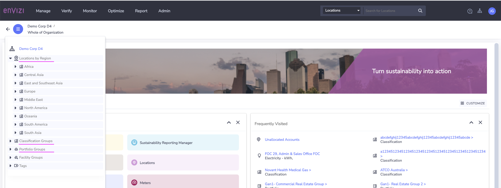
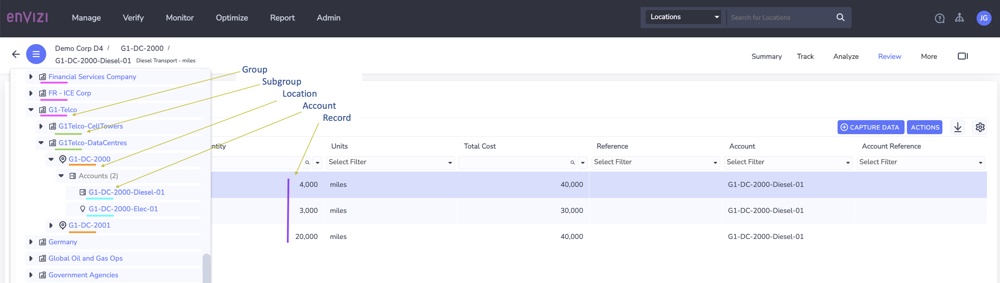
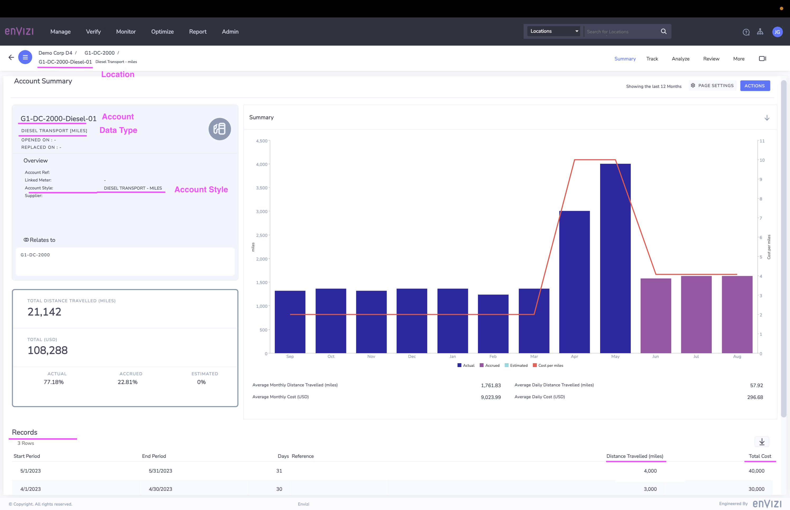
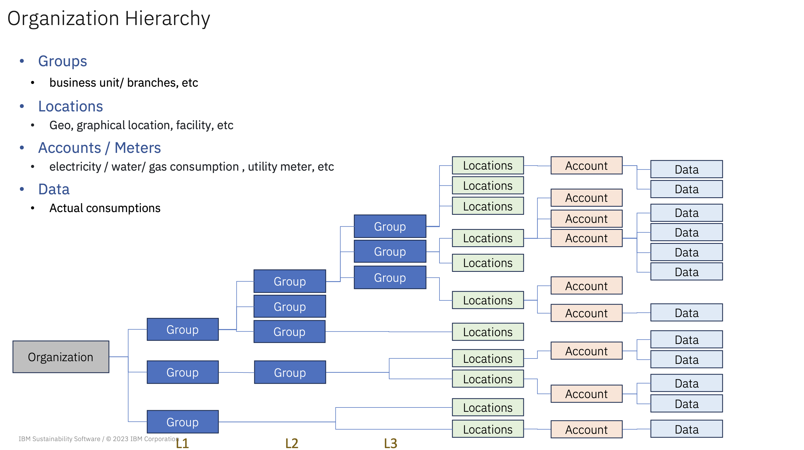
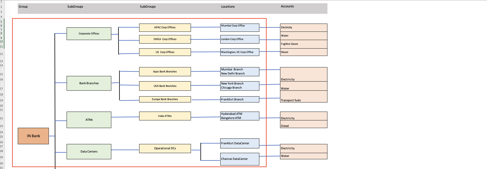
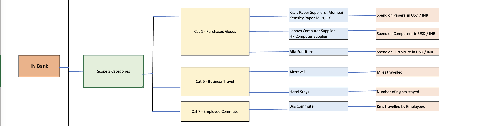

# Organization Hierarchy

Envizi facilitates the organization of data through a hierarchical structure, enabling the creation of groups, subgroups, locations, accounts, meters, records, and more.

Here is the organization hierarchy that shows `Location by Region`, `Classification` and `Portfolio` Groups.

## 1. Definitions

### Groups

Groups are a collection of locations used for reporting or data access.

Groups are two types. The previous 2 images shows both the groups.
- Classification group
- Portfolio group

**Classification :** Classification type represent the foundation structure of the Organization. Each location must report 100% through the Classification hierarchy in order to be 100% included in enterprise reporting. If a location is not part of a group then it will be excluded from most dashboards and reports.

**Portfolio :** Portfolio type groups to reflect secondary reporting structures. 
A portfolio group may include some or all locations of varying report percentage allocations.

Subgroups are created under any group. 

Here you can see the `Classification` and `Portfolio` Groups.

You can see the Group, Subgroup, location, account and records in the Org Hierarchy here.

### Locations

Locations are used to describe buildings, properties, assets or sites within an Organization. An Organization can have multiple locations. Locations can also represent a virtual collection of account data.

The below screenshots shows that the Account is associated with a Location.

### Accounts

Accounts are used to capture, store and report data from the various resources of an organization such as electricity, water, transport and etc.

It is configured at a location level. 
Account is associated with specific specific `data type` and `account style`.

The image shows the Data Type as `DIESEL TRANSPORT (MILES)` and Account style as `DIESEL TRANSPORT - MILES`

### Records

Records represents the actual data from the resources. Ex: The electricity consumption of a particular account for the month.

The above image show the records associated with the account.

## 2. Organization Hierarchy Structure

## 3. Organization Hierarchy Sample

